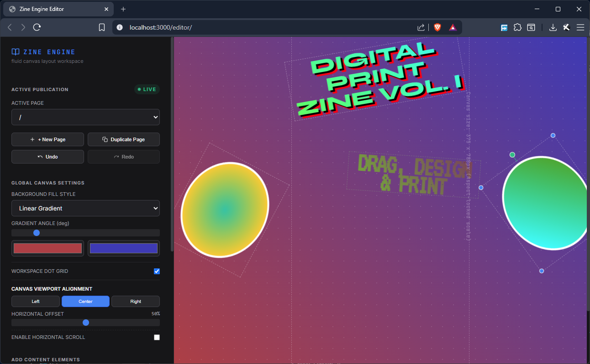

# 📼 Zine Engine



We live in a screen-based world, but the modern web has traded creative freedom for algorithmic optimization and cloud dependency.

**Zine Engine** exists to reclaim the browser as a site for tactile, autonomous art. We concede the hardware—the mobile device, the browser engine—but we reject the corporate ecosystem. It is an offline-first, drag-and-drop digital scrapbook that outputs 100% static, dependency-free HTML. You build it off the grid, and it lasts forever.

Here is the "why" behind how it works:

## 🏛️ CORE PRINCIPLES

1. **Scrapbooking Over Systems:** Creation should be immediate. There are no databases, CMS, or deployment scripts. Just drag, drop, layer, and save.
2. **The Conceded Canvas:** We accept the mobile screen as our baseline medium, but we refuse to let algorithms break the art apart to fit other devices. Your layout acts as a fixed poster that simply scales up proportionally on a desktop, preserving your exact spatial intent.
3. **Vernacular Motion:** We prioritize web-native culture over slick production. There are no complex animation timelines—motion is achieved strictly through mindful layout and the raw inclusion of GIFs.
4. **Architectural Autonomy:** You build the paths. There is no auto-generated navigation. Every page is a blank sheet you connect manually, aided by an engine that quietly maps your local files so you can link them effortlessly.
5. **The Subversive Stack:** We use heavy modern frameworks to build the editor, but strip them away before it reaches your hands. The app you download requires zero dependencies, no cloud accounts, and no internet to run.
6. **HTML as the Artifact:** Digital art shouldn't rot when servers die. The exported zine is purely static, acts as a lossless backup, and leaves no trace of tracking scripts or external libraries.

---

## 🚦 CHOOSE YOUR PATHWAY

Before you proceed, decide how you want to interact with this engine. Choosing the wrong route can lead to unnecessary setup and frustration!

### 🌸 PATH A: I am a Zinester / Artist (I want to make zines!)
You **do not** need to install any development dependencies, compile code, or run npm commands. You can run Zine Engine completely offline and "off the grid."

1. **Do not click the green "Code" button.** Instead, go straight to the [**Releases**](https://github.com/tsdiokno/my-zine-engine/releases) tab on the right side of this page.
2. Download the `Zine-Engine-Release.zip` from the latest release.
3. Unzip the file anywhere on your computer.
4. Open your terminal or command prompt, navigate to the unzipped folder, and run:
   ```bash
   node run.js
   ```
5. Open [http://localhost:3000/editor/](http://localhost:3000/editor/) in your browser and start designing! Your publications will be saved directly into your local `zine-dist/` folder.

---

### 🔧 PATH B: I am a Mechanic / Contributor (I want to hack the code!)
You want to modify the editor's UI, add new layout components, or hack the core compiler. The codebase is a robust, full-stack application.

*   **Editor Tech Stack:** React, Vite, Tailwind CSS.
*   **Dev Server:** Node.js, Express, Multer.

To start hacking on the engine:

1. Clone this repository to your local machine:
   ```bash
   git clone https://github.com/your-username/zine-engine.git
   cd zine-engine
   ```
2. Install all development dependencies:
   ```bash
   npm install
   ```
3. Boot the development workspace:
   ```bash
   npm run dev
   ```
4. Modify files in `editor/` and `src/` to your heart's content. To compile changes for the distribution build, run:
   ```bash
   npm run build
   ```

---

## 🎨 Architectural Overview

Zine Engine maintains a strict separation between **The Factory** (the source code and editor environment) and **The Tool** (the zero-dependency standalone package):

*   `editor/` contains the static HTML/CSS/JS files for the publishing interface.
*   `server.js` is the full Express-based server used during development.
*   `server/run.js` is a tiny, native Node.js HTTP server that handles static asset serving and local file persistence using *only* standard Node modules. It is bundled as `run.js` in the final release package.
*   `zine-dist/` is the storage folder where the editor compiles and writes your custom pages (layouts, index.html files, uploaded image assets, and `state.json` templates).